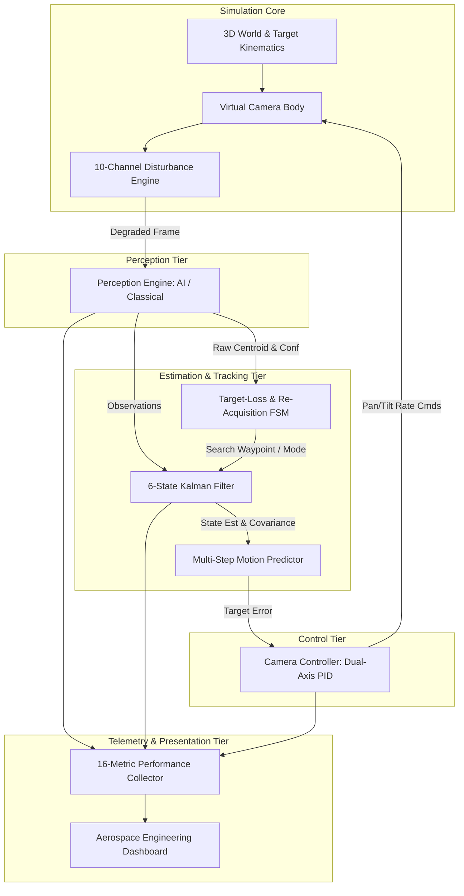
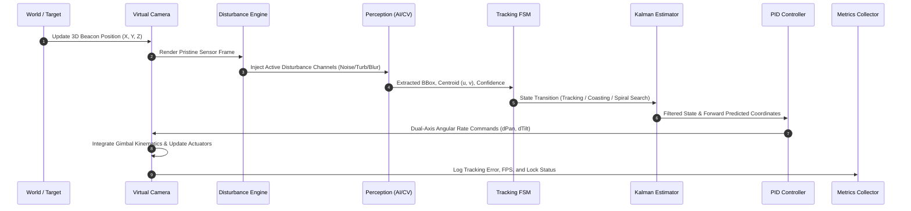
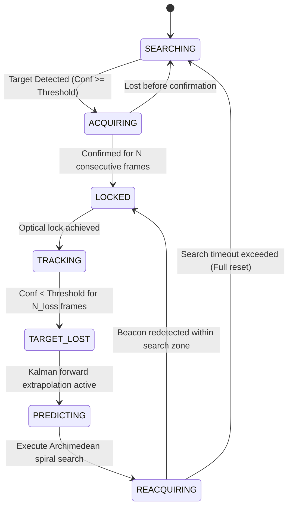

# ASTRATRACK: System Architecture & Design Specification
**Document Classification:** Engineering Architecture Documentation  
**Project:** Smart India Hackathon (SIH 2026) — Aerospace R&D Category  
**System Architecture:** Multi-Tier Deterministic Closed-Loop Simulation & Tracking Engine  

---

## 1. Architectural Principles

ASTRATRACK is architected around five core principles essential for mission-critical aerospace simulation:

1. **Strict Modularity & Decoupled Layers:** Physical simulation, perception, state estimation, control, and user presentation exist in isolated, interface-driven packages.
2. **Bit-Exact Determinism:** Master-seed random number generation ensures that any simulation scenario can be recreated bit-for-bit, enabling scientific reproducibility.
3. **Air-Gapped Self-Containment:** The simulation possesses zero dependencies on cloud APIs, internet connectivity, or proprietary runtime services.
4. **Multi-Rate Operational Bandwidth:** The tracking control loop executes at up to 120 Hz, perception at 30–60 Hz, and telemetry visualization at 60 Hz.
5. **Zero-Fake Data Guarantee:** All telemetry, metrics, and reports are directly derived from online mathematical evaluation of simulation states.

## 2. High-Level System Component Diagram

The diagram below illustrates the major subsystems and their inter-relationships:

## 3. Data Flow & Processing Pipeline

The data flow pipeline executes sequentially on every simulation step $\Delta t$:

## 4. Finite State Machine (FSM) Transition Model

The target loss and re-acquisition engine operates as a 7-state finite state machine:

## 5. Coordinate Systems & Spatial Transformations

ASTRATRACK implements four distinct right-handed coordinate frames:

### 5.1 World Frame $\mathcal{F}_w$
Origin at ground station optical terminal base. Coordinates $\mathbf{p}_w = [X_w, Y_w, Z_w]^T$. Defines absolute spatial positions of optical beacon and ground station platform.

### 5.2 Camera Body Frame $\mathcal{F}_c$
Origin at camera entrance pupil. $Z_c$ aligned with optical boresight, $X_c$ rightwards, $Y_c$ upwards. Transformed from world frame via camera position $\mathbf{p}_{cam}$ and Euler rotation angles $(\psi, \theta)$ (Pan, Tilt):
$$\mathbf{p}_c = R_y(\theta) R_z(\psi) (\mathbf{p}_w - \mathbf{p}_{cam})$$

### 5.3 Pixel Sensor Plane $\mathcal{F}_p$
2D discrete sensor array $(W \times H)$ with origin at top-left pixel. Pinhole perspective projection with focal length $f_x, f_y$ and principal point $(c_x, c_y)$:
$$u = f_x \frac{X_c}{Z_c} + c_x, \quad v = f_y \frac{Y_c}{Z_c} + c_y$$

### 5.4 Actuator Angular Rate Space $\mathcal{F}_a$
Translates pixel error into camera gimbal angular rate commands $(\dot{\psi}, \dot{\theta})$:
$$\dot{\psi}_{cmd} = \text{PID}_{pan}(u - c_x), \quad \dot{\theta}_{cmd} = -\text{PID}_{tilt}(v - c_y)$$

## 6. Mathematical Formulations

### 6.1 Discrete Kalman Filter (Constant Acceleration CA Model)
- **State Vector:** $\mathbf{x} = [x, y, v_x, v_y, a_x, a_y]^T$
- **Continuous White Noise Acceleration (CWNA) Covariance:**
  $$Q = \begin{bmatrix} Q_{1D} & 0 \\ 0 & Q_{1D} \end{bmatrix}, \quad Q_{1D} = q_c \begin{bmatrix} \frac{\Delta t^5}{20} & \frac{\Delta t^4}{8} & \frac{\Delta t^3}{6} \\ \frac{\Delta t^4}{8} & \frac{\Delta t^3}{3} & \frac{\Delta t^2}{2} \\ \frac{\Delta t^3}{6} & \frac{\Delta t^2}{2} & \Delta t \end{bmatrix}$$
- **Measurement Update with Innovation:**
  $$\mathbf{y}_k = \mathbf{z}_k - H \hat{\mathbf{x}}_{k|k-1}$$
  $$S_k = H P_{k|k-1} H^T + R$$
  $$K_k = P_{k|k-1} H^T S_k^{-1}$$
  $$\hat{\mathbf{x}}_{k|k} = \hat{\mathbf{x}}_{k|k-1} + K_k \mathbf{y}_k$$
  $$P_{k|k} = (I - K_k H) P_{k|k-1} (I - K_k H)^T + K_k R K_k^T \quad \text{(Joseph Stabilized Form)}$$

### 6.2 Dual-Axis PID Control with Anti-Windup & Derivative Filter
- **Integral Accumulation:**
  $$I(k) = I(k-1) + e(k) \Delta t$$
  $$I(k) = \text{clamp}\left(I(k), -\frac{u_{max}}{K_i}, \frac{u_{max}}{K_i}\right)$$
- **Filtered Derivative:**
  $$D(k) = \alpha \frac{e(k) - e(k-1)}{\Delta t} + (1 - \alpha) D(k-1)$$
- **Total Output with Dead-Zone:**
  $$u(k) = \begin{cases} 0 & \text{if } |e(k)| \le e_{dead} \\ \text{clamp}(K_p e(k) + K_i I(k) + K_d D(k), -u_{max}, u_{max}) & \text{otherwise} \end{cases}$$

### 6.3 Archimedean Spiral Re-Acquisition Path
When entering `REACQUIRING`, search coordinates are generated parameterized by angular displacement $\theta(t) = \omega t$:
$$r(t) = r_0 + \frac{v_{search}}{2\pi} \theta(t)$$
$$x_{cmd}(t) = x_{last} + r(t) \cos(\theta(t)), \quad y_{cmd}(t) = y_{last} + r(t) \sin(\theta(t))$$
Guaranteeing uniform spatial scanning of the uncertainty ellipse without blind spots.

## 7. Threading, Timing, and Determinism

- **Synchronous Simulation Stepping:** All submodules advance via a unified discrete time-step $\Delta t = 1/FPS$.
- **Master PRNG Architecture:** High-quality Mersenne Twister / PCG streams keyed by master seed, ensuring zero cross-run divergence.
- **UI Decoupling:** The UI rendering loop is decoupled from simulation updates using double-buffered telemetry state snapshots, eliminating UI thread jitter on simulation dynamics.
